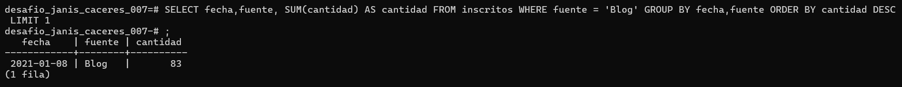

# Screenshots del Trabajo

Aquí están los screenshots de las consultas realizadas.

## Screenshots

### ¿Cuántos registros hay?

### ¿Cuántos inscritos hay en total?

### ¿Cuál o cuáles son los registros de mayor antigüedad?

### ¿Cuántos inscritos hay por día? (Indistintamente de la fuente de inscripción)

### ¿Cuántos inscritos hay por fuente?

### ¿Qué día se inscribió la mayor cantidad de personas? Y ¿Cuántas personas se inscribieron en ese día?

### ¿Qué día se inscribieron la mayor cantidad de personas utilizando el blog? ¿Cuántas personas fueron? (si hay más de un registro con el máximo de personas, considera solo el primero)

### ¿Cuál es el promedio de personas inscritas por día? Toma en consideración que la base de datos tiene un registro de 8 días, es decir, se obtendrán 8 promedios.

### ¿Qué días se inscribieron más de 50 personas?

### ¿Cuál es el promedio por día de personas inscritas? Considerando sólo calcular desde el tercer día.

